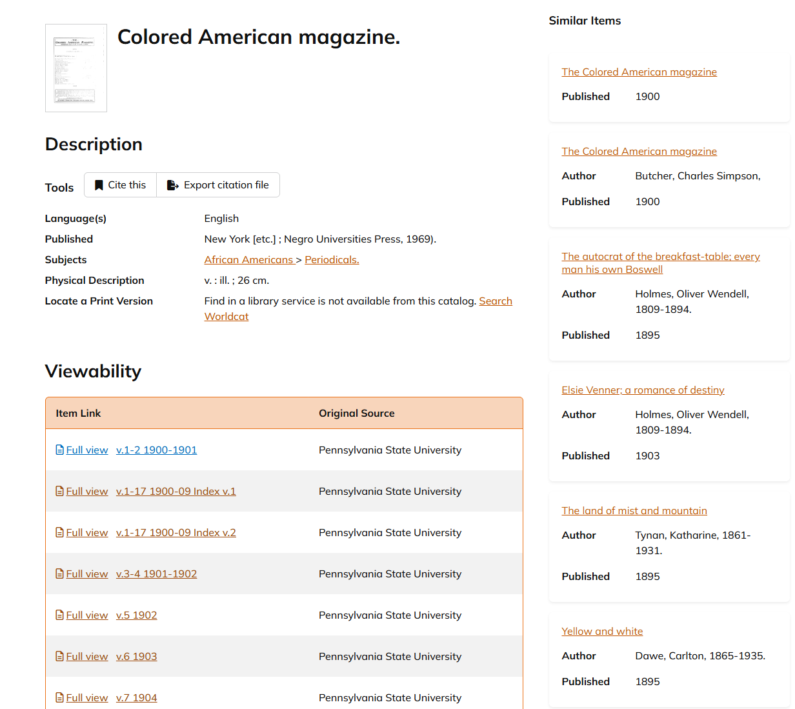
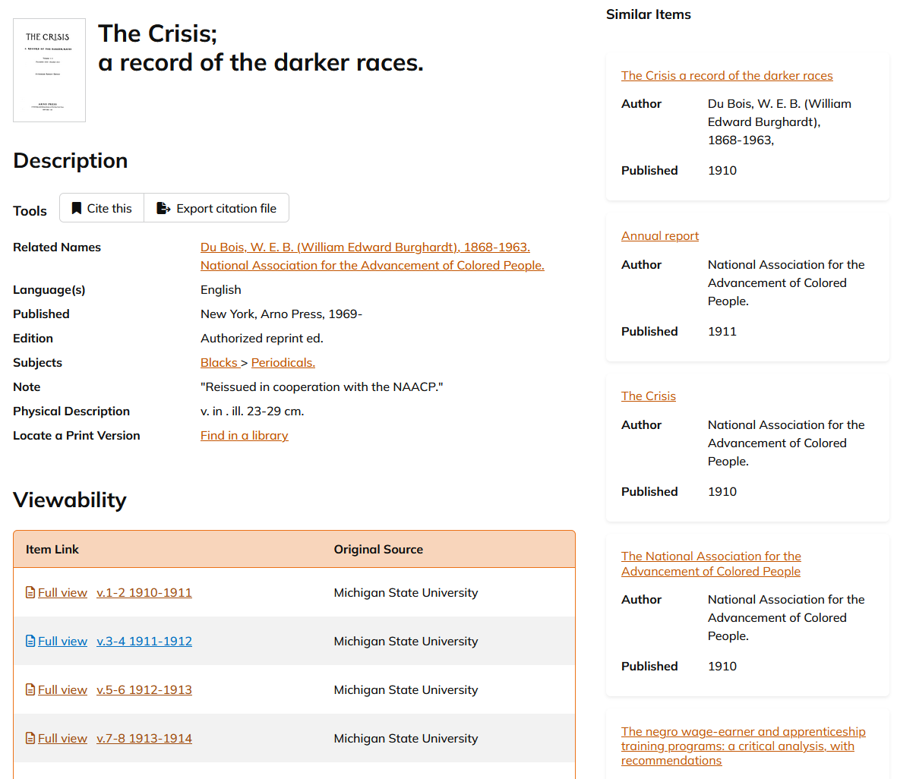
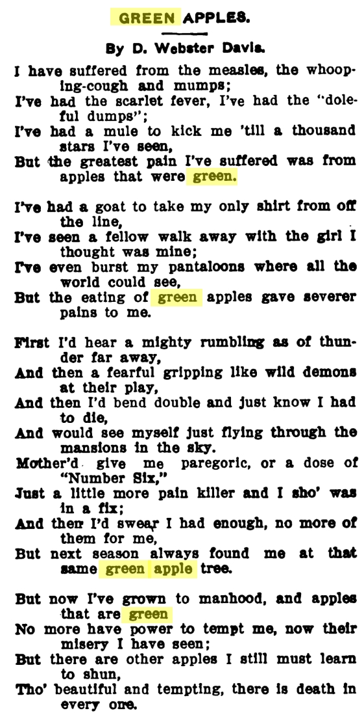
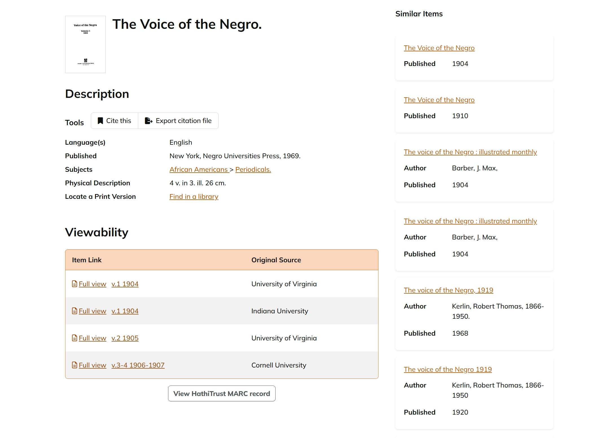

# Mass Digitization & Digital Libraries  
## HathiTrust Exploration – Group Assignment

---

# Part 1: Exploring HathiTrust

## Search Strategies and Barriers 

**Search strategies used**
- Searching by magazine title
- Searching by author name
- Narrowing by publication year
- Browsing tables of contents

**Barriers encountered**
- OCR errors affecting search
- Missing or restricted issues
- Inconsistent metadata
- Time required to scroll long issues

---

## Individual Poem Analyses

### Jesus Vazquez

**Poem Title:** New Wars
**Author:** Benjamin Griffith Brawley
**Magazine:** Colored American Magazine
**Issue Date:** v.1-2 (1900-1901)
**HathiTrust Link:** https://babel.hathitrust.org/cgi/pt?id=pst.000053237019&seq=300&q1=Brawley

#### Search Process
- How I searched: I searched HathiTrust using the magazine title *Colored American Magazine* and narrowed results by year. I then used the search within text feature to search for the author's last name, Brawley.The poem appeared in the results and I navigated to the page to confirm it.
- Was it easy to find: Yes it was fairly easy to find after understanding how HathiTrust website worked.
- Challenge encountered: One challenge was that OCR search was not perfectly accurate, so some scrolling was required to verify the poem location.

#### OCR Observations
- OCR issue noticed: Some punctuation is faded out, and line spacing is not perfectly recognized in the OCR text.
- Another issue: Poetry formatting, especially line breaks and indentation, made OCR less reliable than with normal paragraphs.
- How this affects research: This could affect research because key word searches might miss poems or return incomplete results if OCR errors occur.

#### Context Comparison
- Context gained from original page: Seeing the original page showed that the poem appears as a part of a larger section in the magazine giving historical and editorial context.
- What the dataset removes: The dataset removes layout, typography, and surrounding material such as headings or nearby text.
- What the dataset makes easier: The dataset makes it easier to seach organize, and analyze poems across many different issues.

#### Screenshots

---

### Javier Martinez

**Poem Title:** Thoughts of Death
**Author:** Sterling A. Brown
**Magazine:** Opportunity Magazine 
**Issue Date:** August 1928
**HathiTrust Link:** https://babel.hathitrust.org/cgi/pt?id=wu.89073161770&seq=280

#### Search Process
- How I searched:
I used the African American Periodical Poetry dataset to find the poem title, author, magazine name, and year. I searched HathiTrust by the magazine title (Opportunity) rather than the poem title, since poems are included within full magazine issues. After opening the correct issue, I used the search feature to locate the poem and navigated to the correct page.

- Was it easy to find?
Yes, it was easy to find once I opened the correct issue. The search feature made locating the poem quick and straightforward.

- Challenge encountered?
There were very few challenges. The main requirement was knowing the magazine name ahead of time, since poems are not listed individually.

#### OCR Observations
- Can you search for specific words or phrases within the document?
Yes, I was able to search for specific words and phrases using the search feature.

- How accurate is the searchable text compared to the page images?
The searchable text is generally accurate and closely matches what appears in the page images.

- What kinds of errors do you notice?
I did not notice any major issues on this page. The text and layout were clear and readable.

- How might this affect research using this material?
Since there were no major issues, the searchable text is useful for finding and reading the poem, although the page image is still the most reliable source for formatting.

#### Context Comparison
- What additional context do you gain from seeing the original page?
Seeing the original page shows how the poem was formatted and presented within Opportunity, including typography and placement.

- What else appears on the page or in the issue alongside the poem?
The poem appears alongside other literary and editorial content from the same issue.

- What information was lost in creating just the dataset of poems?
The dataset removes visual layout, formatting, and information about what surrounded the poem in the magazine.

- What information was gained by creating the structured dataset?
The dataset makes poems easier to search, organize, and compare across different authors, years, and magazines.

#### Access and Rights
- Can you download the full PDF? Individual page images?
Individual page images can be downloaded directly. To download the full magazine as one PDF, you must be affiliated with a participating institution.

- Are there any access restrictions?
The magazine issue is available in full view, but full-document downloads are restricted to users with institutional access.

- What copyright or usage information is provided?
HathiTrust provides information explaining how the material can be accessed and what download options are available based on user affiliation.

- How does HathiTrust balance preservation, access, and copyright?
HathiTrust preserves historical materials and allows public viewing, while restricting full downloads to users affiliated with institutions in order to respect copyright and usage policies.

#### Metadata and Organization
- What metadata is provided for the item you’re viewing?
The metadata includes the magazine title, publication date, volume information, and the institution that contributed the item.

- How does this compare to the records discussed in class?
The metadata focuses on describing the magazine at the issue level, similar to library catalog records.

- What other data could have the authors collected?
Page numbers for individual poems or direct links to the poem’s page could have been included.

- Would you organize the dataset differently?
I would include page-level links and more contextual information to better connect each poem to its original magazine setting.

#### Screenshots

---

### Charles Cantrell

**Poem Title:** Joseph Pulitzer
**Author:** W.E.B. Du Bois
**Magazine:** The Crisis
**Issue Date:** December 1911
**HathiTrust Link:** https://babel.hathitrust.org/cgi/pt?id=msu.31293106408077&seq=67&q1=Softly%2C%20quite%20softly

### Search Process
- How I searched: I searched the HathiTrust using the text under the "text" column that was in Hennessey dataset, then I specified the author as W.E.B. Du Bois, and then specified the publication range of 1910-1919. From there I opened the "The Crisis" issue and searched the text to find specifically the poem I was looking for.
- Was it easy to find: Somewhat, I found it initially difficult until I learned how to work the search tools to search what I was wanting to find. 
- Challenge encountered: One challenge is that the text I was using for the OCR search was slightly different as it didnt recognize that the text had a new line after the first few words, thus I had to modify the text I searched for(shortening the quote) to find my poem.

### OCR Observations
- Minor differences or oddities with OCR: Some phases are combined, so searching is a little bit off, but most words & phases work.
- Other Issues: Similar to what Jesus observed the OCR seems to have some trouble with line breaks or the continuation of text onto a new line.
- The text is pretty legiable, but on smaller print the text seems a bit blurry legibility-wise.
- How might this affect research: Some things like phases being grouped together makes it abit more difficult to search for a very particualar line of text if you dont know it needs more parts of the line to show up as a result.

### Understanding Context
- Context gained from original page: The poem is one part of a bigger text, where the original page only gives the context that it was a poem. It also offers that the poem is a tribute to the at the time somewhat recently past Joseph Pulitzer. There also is an additional bit on why he is being honored with the section in the context of being more fair to the black community than other publications in New York.
- What information was lost with the dataset: The dataset removes the context for why the poem is in the magazine, and specifically the whole contents or text of the poem. Things like sub-headings, layout/formatting, and page the poem appears on were lost.
- What information was gained the structured dataset: The structured dataset allowed discovery of the poem to be easier, as one doesnt need to specifically go through all magazines to find if theres poems and what the poem is. Searchability and accessibility is gained specifically for poems.

### Access and Rights
- Can you download the full PDF? Individual page images?
Specific pages can be downloaded as images, PDF, or TXT file. However in order to download the full magazine you must be apart of an affiliated institution.

- Are there any access restrictions? (full view vs. limited preview)
Full view of the document is available, and is not a limited preview of the full magazine.

- What copyright or usage information is provided?
The magazine is stated to be public domain, and thus can be used as public-domain documents are able to be used.

- How does HathiTrust balance preservation, access, and copyright?
HathiTrust provides a platform that hosts the document to be accessible and viewable, but limits the ability for the full document to be downloaded, and google are the ones who scanned the document so links to their services with the document are provided. There also is an Owner-ID number for each page.

### Metadata and Organization
- What metadata is provided for the item you’re viewing?
Title of the Magazine, The title of the particular volume of the magazine, publication year, version date/time, the institution that digitized the document, Section pages, and section scan order are all forms of metadata that is provided.
- How does this compare to the MARC records discussed in class?
There is relevant information pertaining to finding the document, version creation, and other data needed for library catalog for the origin of the particular document scan.

- What other data could have the authors collected?
Specific section titles rather than the "Section ##" format they are using, as there are headings for each part of the magazine that helps tell what kind of information is being written in that particular part. 
- Would you organize the dataset differently?
I would put the name of the publication as well as publication month and year before the sample of text that is provided in the dataset.

#### Screenshots

---

### Hongli Peng

**Poem Title:** Green Apples
**Author:** Daniel Webster Davis
**Magazine:** Voice of Negro
**Issue Date:** 1905
**HathiTrust Link:** https://babel.hathitrust.org/cgi/pt?id=uva.x000492470&seq=778&q1=Green+apple

### Search Process
- How I searched: I searched the HathiTrust using the search inputbox to search the magazine Voice of Negro, then specified the publication range of 1905. From there I opened issue and searched the text to find specifically the poem I was looking for.
- Was it easy to find: Pretty easy, search function make it easy to find. 
- Challenge encountered: There wasn’t really a challenge—everything needed was already known; it just required searching.”

### OCR Observations
- OCR issue noticed: when searching, extra spaces are sometimes included in the recognized English words.
- Other Issues: The text is readable, but not very clear.
- How might this affect research: The extra spaces may lead to difficult search.

### Understanding Context
- What additional context do you gain from seeing the original page? Seeing the original page shows how the poem was formatted and presented
- What else appears on the page or in the issue alongside the poem? The poem appears with other literary and editorial content in the same issue.
- What information was lost in creating just the dataset of poems? The poetry dataset omits the original formatting of the poem, although the visual arrangement of the text is an important part of its aesthetic.
- What information was gained by creating the structured dataset? The dataset allows poems to be more easily searched, organized.

### Access and Rights
- Can you download the full PDF? Individual page images?
To download the full magazine as one PDF, you must be affiliated with a participating institution.

- Are there any access restrictions? (full view vs. limited preview)
The magazine issue can be viewed in its entirety online, but downloading the complete document is limited to users with institutional access.

- What copyright or usage information is provided?
The magazine is stated to be public domain, and thus can be used as public-domain documents are able to be used.

- How does HathiTrust balance preservation, access, and copyright?
HathiTrust provides access to historical materials for public viewing, but full downloads are limited to institution-affiliated users. The documents were scanned by Google, with links to their services included, and each page carries an Owner-ID for identification.

### Metadata and Organization
- What metadata is provided for the item you’re viewing?
Title of the Magazine, The title of the particular volume of the magazine, publication year, version date/time

- How does this compare to the MARC records discussed in class?
It includes information useful for finding the document, documenting version history, and providing other details required for library cataloging of the scanned item.

- What other data could have the authors collected?
Page numbers for individual poems
- Would you organize the dataset differently?
I would put the direct links to the poem’s page

#### Screenshots

---

# Part 2: Discovering & Digitizing Cultural Objects

## Area of Focus
(Describe our groups cultural focus in 1–2 sentences)
Our group’s shared thematic focus is gaming, understood as a cultural, social, and economic phenomenon rather than just a technical artifact. We are interested in how video games shape player behavior, communities, identity, and meaning, and how these dimensions can be explored through data.
---

## Digital Objects & Representations
## Player Avatar
**Why it counts as a digital object:**  
A player avatar is a digital representation of the player in the game world.  
It represents the player’s identity, actions, and presence within the virtual environment.

## Game Maps
**Why it counts as a digital object:**  
Game maps are digital representations of physical or imaginary spaces.  
They translate geography, architecture, and spatial design into navigable digital environments that players can explore and interact with.
---

## Digitization Processes
- How objects are digitized: digital modeling, animation and motion capture
- Comparison to HathiTrust:
-Goes beyond text to include visuals, movement, sound, and interaction.
-Often creates new digital objects rather than directly reproducing physical ones.

---

## Historical Equivalents
- Example: Boaard Games and Tabletop Games
- Comparison to digital version:
-Physical game components are limited by material form and space.
-Digital games can automate rules, generate complex worlds, and allow real-time interaction across distances.
-Both rely on structured rules and player participation to create meaning and play.
---

## Born-Digital Materials
- Example: Virtual items
- How they differ from digitized materials:
-Born-digital materials are digital from creation; digitized objects originate in the physical world.
-Born-digital materials rely entirely on software and platforms, while digitized objects preserve references to real-world originals.
---

## Oldest Digital Library or Archive
- Name: Internet Archive – Software & Video Game Collection
- Link: https://archive.org/details/software
- How it has been maintained: The Internet Archive preserves games through long-term institutional support, community contributions, and ongoing file migration, while providing browser-based emulation to maintain access to legacy games.
- Metadata or standards used: Metadata includes basic descriptive fields such as title, platform, release date, file format, and access or copyright status, emphasizing accessibility rather than strict library cataloging standards.

---

## Newest Digital Library or Archive
- Name: Video Game History Foundation – Digital Archive
- Link: https://gamehistory.org/collections/
- How it compares to older archives: Compared to older archives, the Video Game History Foundation emphasizes contextual and research-oriented materials—such as development documents and industry ephemera—along with more detailed curatorial metadata.

---

## Skins as culture and storytelling
Skins are just a digital object but they let players signal who they are and how they want to be seen. Many iconic skins are tied to esports moments, streamers, or specific eras of the game. 
**Example:**  
In Counter Strike history, there are various skins or stickers (Digital Objects) that function like portable pieces of Counter Strike history. Souvenir skins and Major stickers turn a weapon into a story. If someone seems a Souvenir AWP Dragon Lore with a particular sticker combo, they could recognize a specific tournament, player, team or a legendary moment. Over time these digital objects become part of the culture and story of Counter Strike, they start to look more like collectibles than just digital objects, because they preserve events, rosters and memories.
**Impact:**
The surrounding marketplaces, clips, screenshots, moments are all just data that show how people live and express themselves in an online game. This further increases the need to create digital libraries and archives that preserve these stories. 

---

## Free vs Proprietary Access

**Free Example**
- Name:
- Link:
- Notes:

**Proprietary Example**
- Name:
- Link:
- Notes:

**Differences**
- Access:
- Metadata:
- Preservation approach:

---

# Links and Screenshots Log

(List every resource used)

- Link:
- Description:
- Screenshot file name:

---

# Member Contributions

- Jesus Vazquez: Formatted github repo and README.md, located one poem in HathiTrust, analyzed OCR quality, and compared dataset context to original page.
- Javier Martinez: Reformatted Part 1 and completed one full poem analysis addressing all questions.
- Charles Cantrell: Located poem from Hennessey dataset on HathiTrust, did OCR analysis, discussed section formatting for group portioning with Jesus.
- Hongli Peng: Located poem from Hennessey dataset on HathiTrust, did OCR analysis, did 1-4 parts of part 2
- Raymond Lu: Finished 5-6 paarts of part 2
- Anshuman Satpute: Finished 7-8 parts of part 2, cultural context analysis for digital objects. 

