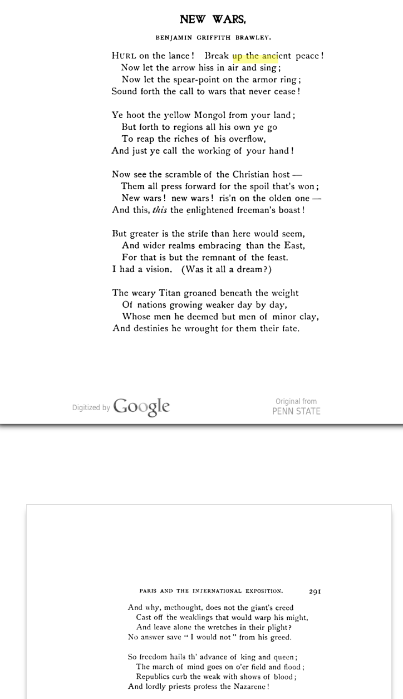
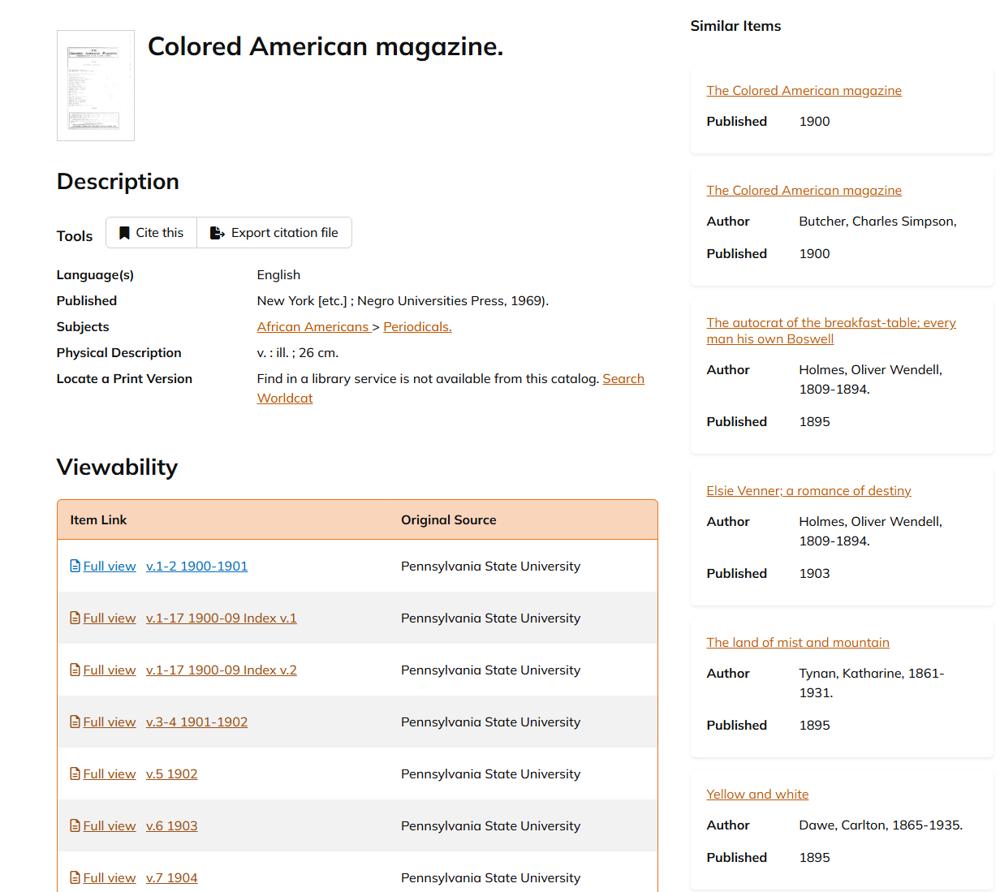

# Mass Digitization & Digital Libraries  
## HathiTrust Exploration – Group Assignment

---

# Part 1: Exploring HathiTrust

## Search Strategies and Barriers 

**Search strategies used**
- Searching by magazine title
- Searching by author name
- Narrowing by publication year
- Browsing tables of contents

**Barriers encountered**
- OCR errors affecting search
- Missing or restricted issues
- Inconsistent metadata
- Time required to scroll long issues

---

## Individual Poem Analyses

### Jesus Vazquez

**Poem Title:**  
**Author:**  
**Magazine:**  
**Issue Date:**  
**HathiTrust Link:**  

#### Search Process
- How I searched:
- Was it easy to find:
- Challenge encountered:

#### OCR Observations
- OCR issue noticed:
- Another issue:
- How this affects research:

#### Context Comparison
- Context gained from original page:
- What the dataset removes:
- What the dataset makes easier:

#### Screenshots
*(Insert screenshots name the file that for it to show up)*

---

### Group Member 2

**Poem Title:**  
**Author:**  
**Magazine:**  
**Issue Date:**  
**HathiTrust Link:**  

#### Search Process
- How I searched:
- Was it easy to find:
- Challenge encountered:

#### OCR Observations
- OCR issue noticed:
- Another issue:
- How this affects research:

#### Context Comparison
- Context gained from original page:
- What the dataset removes:
- What the dataset makes easier:

#### Screenshots
*(Insert screenshots name the file that for it to show up)*

---

### Group Member 3

**Poem Title:**  
**Author:**  
**Magazine:**  
**Issue Date:**  
**HathiTrust Link:**  

#### Search Process
- How I searched:
- Was it easy to find:
- Challenge encountered:

#### OCR Observations
- OCR issue noticed:
- Another issue:
- How this affects research:

#### Context Comparison
- Context gained from original page:
- What the dataset removes:
- What the dataset makes easier:

#### Screenshots
*(Insert screenshots name the file that for it to show up)*

---

## Access & Rights

- Access level (Full View or Limited):
- Download options available:
- Copyright or usage information:
- Observations on preservation vs access:

---

## Metadata and Organization

**Metadata provided**
- Title
- Author
- Publication date
- Publisher
- Subjects
- Other:

**Comparison to MARC-style records**
- Observations:

**Suggested additional metadata**
- Example:
- Example:
- Example:

---

# Part 2: Discovering & Digitizing Cultural Objects

## Area of Focus
(Describe our groups cultural focus in 1–2 sentences)

---

## Digital Objects & Representations
- Example:
- Why it counts as a digital object:

---

## Digitization Processes
- How objects are digitized:
- Comparison to HathiTrust:

---

## Historical Equivalents
- Example:
- Comparison to digital version:

---

## Born-Digital Materials
- Example:
- How they differ from digitized materials:

---

## Oldest Digital Library or Archive
**Name:**  
**Link:**  
**How it has been maintained:**  
**Metadata or standards used:**

---

## Newest Digital Library or Archive
**Name:**  
**Link:**  
**How it compares to older archives:**

---

## Viral Example
**Example:**  
**How it went viral:**  
**Impact:**

---

## Free vs Proprietary Access

**Free Example**
- Name:
- Link:
- Notes:

**Proprietary Example**
- Name:
- Link:
- Notes:

**Differences**
- Access:
- Metadata:
- Preservation approach:

---

# Links and Screenshots Log

(List every resource used)

- Link:
- Description:
- Screenshot file name:

---

# Member Contributions

- Jesus Vazquez: Formatted github repo and README.md, located one poem in HathiTrust, analyzed OCR quality, and compared dataset context to original page.
- Member 2:
- Member 3:
- Member 4:
