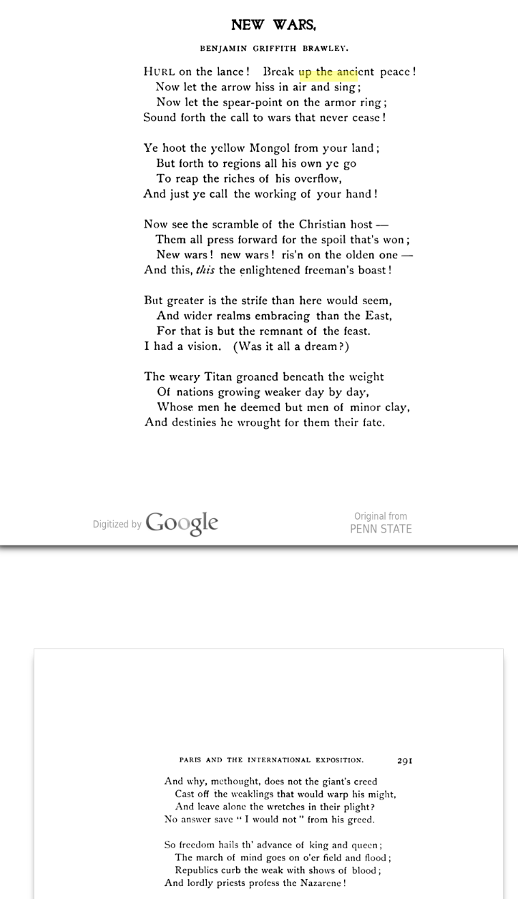
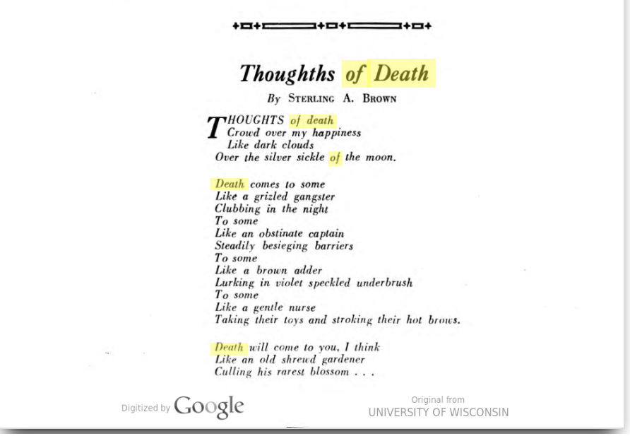
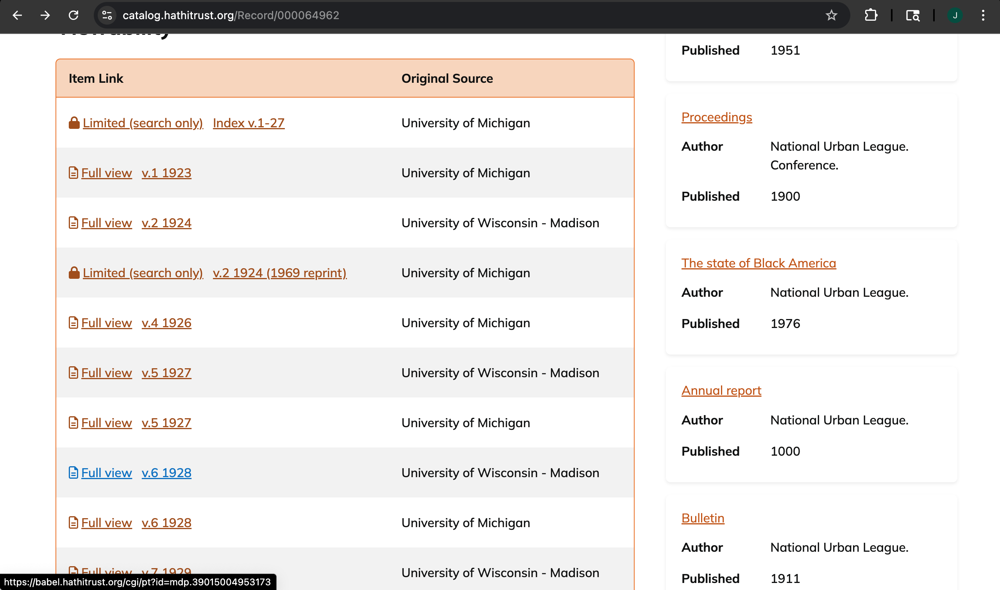
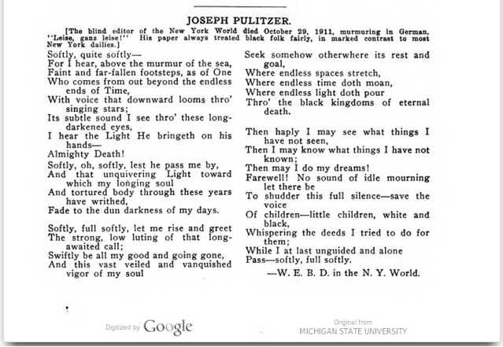

# Mass Digitization & Digital Libraries  
## HathiTrust Exploration – Group Assignment

---

# Part 1: Exploring HathiTrust

## Search Strategies and Barriers 

**Search strategies used**
- Searching by magazine title
- Searching by author name
- Narrowing by publication year
- Browsing tables of contents

**Barriers encountered**
- OCR errors affecting search
- Missing or restricted issues
- Inconsistent metadata
- Time required to scroll long issues

---

## Individual Poem Analyses

### Jesus Vazquez

**Poem Title:** New Wars
**Author:** Benjamin Griffith Brawley
**Magazine:** Colored American Magazine
**Issue Date:** v.1-2 (1900-1901)
**HathiTrust Link:** https://babel.hathitrust.org/cgi/pt?id=pst.000053237019&seq=300&q1=Brawley

#### Search Process
- How I searched: I searched HathiTrust using the magazine title *Colored American Magazine* and narrowed results by year. I then used the search within text feature to search for the author's last name, Brawley.The poem appeared in the results and I navigated to the page to confirm it.
- Was it easy to find: Yes it was fairly easy to find after understanding how HathiTrust website worked.
- Challenge encountered: One challenge was that OCR search was not perfectly accurate, so some scrolling was required to verify the poem location.

#### OCR Observations
- OCR issue noticed: Some punctuation is faded out, and line spacing is not perfectly recognized in the OCR text.
- Another issue: Poetry formatting, especially line breaks and indentation, made OCR less reliable than with normal paragraphs.
- How this affects research: This could affect research because key word searches might miss poems or return incomplete results if OCR errors occur.

#### Context Comparison
- Context gained from original page: Seeing the original page showed that the poem appears as a part of a larger section in the magazine giving historical and editorial context.
- What the dataset removes: The dataset removes layout, typography, and surrounding material such as headings or nearby text.
- What the dataset makes easier: The dataset makes it easier to seach organize, and analyze poems across many different issues.

#### Screenshots
*(Insert screenshots name the file that for it to show up)*

---

### Group Member 2

### Javier Martinez

**Poem Title:** Thoughts of Death
**Author:** Sterling A. Brown
**Magazine:** Opportunity Magazine 
**Issue Date:** August 1928
**HathiTrust Link:** https://babel.hathitrust.org/cgi/pt?id=wu.89073161770&seq=280

#### Search Process
- How I searched:
I used the African American Periodical Poetry dataset to find the poem title, author, magazine name, and year. I searched HathiTrust by the magazine title (Opportunity) rather than the poem title, since poems are included within full magazine issues. After opening the correct issue, I used the search feature to locate the poem and navigated to the correct page.

- Was it easy to find?
Yes, it was easy to find once I opened the correct issue. The search feature made locating the poem quick and straightforward.

- Challenge encountered?
There were very few challenges. The main requirement was knowing the magazine name ahead of time, since poems are not listed individually.

#### OCR Observations
- Can you search for specific words or phrases within the document?
Yes, I was able to search for specific words and phrases using the search feature.

- How accurate is the searchable text compared to the page images?
The searchable text is generally accurate and closely matches what appears in the page images.

- What kinds of errors do you notice?
I did not notice any major issues on this page. The text and layout were clear and readable.

- How might this affect research using this material?
Since there were no major issues, the searchable text is useful for finding and reading the poem, although the page image is still the most reliable source for formatting.

#### Context Comparison
- What additional context do you gain from seeing the original page?
Seeing the original page shows how the poem was formatted and presented within Opportunity, including typography and placement.

- What else appears on the page or in the issue alongside the poem?
The poem appears alongside other literary and editorial content from the same issue.

- What information was lost in creating just the dataset of poems?
The dataset removes visual layout, formatting, and information about what surrounded the poem in the magazine.

- What information was gained by creating the structured dataset?
The dataset makes poems easier to search, organize, and compare across different authors, years, and magazines.

#### Access and Rights
- Can you download the full PDF? Individual page images?
Individual page images can be downloaded directly. To download the full magazine as one PDF, you must be affiliated with a participating institution.

- Are there any access restrictions?
The magazine issue is available in full view, but full-document downloads are restricted to users with institutional access.

- What copyright or usage information is provided?
HathiTrust provides information explaining how the material can be accessed and what download options are available based on user affiliation.

- How does HathiTrust balance preservation, access, and copyright?
HathiTrust preserves historical materials and allows public viewing, while restricting full downloads to users affiliated with institutions in order to respect copyright and usage policies.

#### Metadata and Organization
- What metadata is provided for the item you’re viewing?
The metadata includes the magazine title, publication date, volume information, and the institution that contributed the item.

- How does this compare to the records discussed in class?
The metadata focuses on describing the magazine at the issue level, similar to library catalog records.

- What other data could have the authors collected?
Page numbers for individual poems or direct links to the poem’s page could have been included.

- Would you organize the dataset differently?
I would include page-level links and more contextual information to better connect each poem to its original magazine setting.

#### Screenshots
*(Insert screenshots name the file that for it to show up)*

---

### Group Member 3

**Poem Title:**  
**Author:**  
**Magazine:**  
**Issue Date:**  
**HathiTrust Link:**  

### Search Process
- How I searched:

- Was it easy to find?

- Challenge encountered?

### OCR Observations
- Can you search for specific words or phrases within the document?

- How accurate is the searchable text compared to the page images?

- What kinds of errors do you notice? (fonts, layout, damaged pages, etc.)

- How might this affect research using this material?

### Understanding Context
- What additional context do you gain from seeing the original page?

- What else appears on the page or in the issue alongside the poem?

- What information was lost in creating just the dataset of poems?

- What information was gained by creating the structured dataset?

### Access and Rights
- Can you download the full PDF? Individual page images?

- Are there any access restrictions? (full view vs. limited preview)

- What copyright or usage information is provided?

- How does HathiTrust balance preservation, access, and copyright?

### Metadata and Organization
- What metadata is provided for the item you’re viewing?

- How does this compare to the MARC records discussed in class?

- What other data could have the authors collected?

- Would you organize the dataset differently?

#### Screenshots
*(Insert screenshots name the file that for it to show up)*

---

# Part 2: Discovering & Digitizing Cultural Objects

## Area of Focus
(Describe our groups cultural focus in 1–2 sentences)

---

## Digital Objects & Representations
- Example:
- Why it counts as a digital object:

---

## Digitization Processes
- How objects are digitized:
- Comparison to HathiTrust:

---

## Historical Equivalents
- Example:
- Comparison to digital version:

---

## Born-Digital Materials
- Example:
- How they differ from digitized materials:

---

## Oldest Digital Library or Archive
**Name:**  
**Link:**  
**How it has been maintained:**  
**Metadata or standards used:**

---

## Newest Digital Library or Archive
**Name:**  
**Link:**  
**How it compares to older archives:**

---

## Viral Example
**Example:**  
**How it went viral:**  
**Impact:**

---

## Free vs Proprietary Access

**Free Example**
- Name:
- Link:
- Notes:

**Proprietary Example**
- Name:
- Link:
- Notes:

**Differences**
- Access:
- Metadata:
- Preservation approach:

---

# Links and Screenshots Log

(List every resource used)

- Link:
- Description:
- Screenshot file name:

---

# Member Contributions

- Jesus Vazquez: Formatted github repo and README.md, located one poem in HathiTrust, analyzed OCR quality, and compared dataset context to original page.
- Javier Martinez: Reformatted Part 1 and completed one full poem analysis addressing all questions.
- Member 3:
- Member 4:
